Ok, so I wanted to write a product review of all the stuff I used on the AT because I think that's important information, and Amazon never accepts my product reviews (I feel like theres some goodharting going on in Amazon behind the scenes in their product review verification process or something)

I thru hiked the AT in spring of 2022: started on March 23rd at Amicalola (iirc) and finished at Katahdin on July 9th (again iirc)

Anyway,

# Shoes: Columbia Redmond v2
[Amazon](https://www.amazon.com/Columbia-Redmond-Hiking-Pebble-Regular/dp/B07JGDCRZ7/ref=sr_1_8)

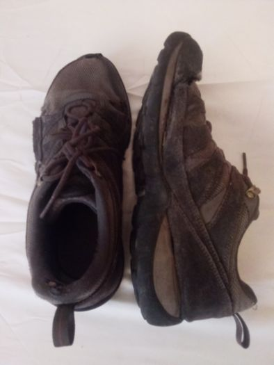

They were like $65 each time I bought them (one before starting the trail and once on the trail)

These are not great shoes lol but the soles (in and out) last forever. In fact, I probably could have walked the entire AT without the soles wearing through or the tread fully smoothing out if the sides didn't blow out. Because, well, the sides blow out consistently with these shoes. In their defence, they don't sell Redmond v2 11 wides and I should have been wearing wides, so there was always a constant pressure at the points where the shoes would consistently blow out

I hiked maybe 80 miles in my first pair before going on the AT to break them in. I changed them out in that weird little town in Virginia thats in the valley which is constantly swampy. Just after the icecream place (in Pine Furnace State park?) you head northeast and into this town, take a right at the post office and AT musuem or whatever it was and I changed my first pair of shoes there. I want to say it was like 800 miles in

As seemed to be the consensus by hikers on the AT: the more durable the tread on your shoe, the less grippy they are, and that seemed to be the case in my experience as well. These shoes have supremely durable tread but don't grip very well. Obviously that's a problem because the AT is mega-vertical and requires *grip*

Because the sides busted out, I had to tape and glue and do all sorts of weird stuff to the final pair to keep them together. I don't actually remember what they were like when I went up Katahdin though

# Backpack: Kelty Tioga 5500
[Kelty Trekker on Amazon](https://www.amazon.com/Kelty-Trekker-Backpack-Garnet-Red/dp/B014JQ9CYK/ref=sr_1_1)

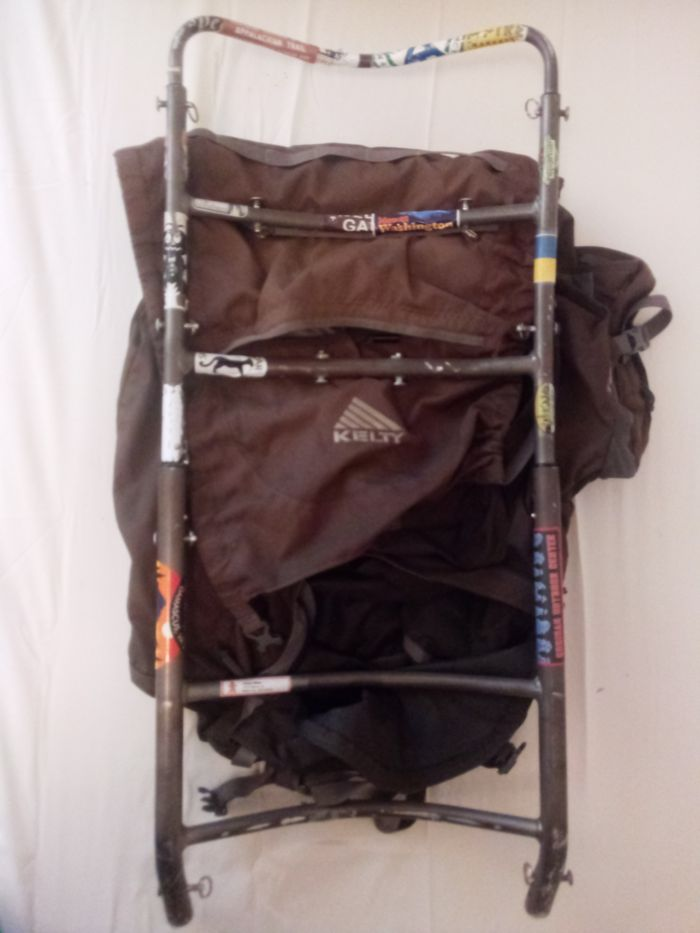
Huh, looks like they don't have the Tioga on Amazon anymore

The Tioga is a massive beast of a pack. Iirc it's like 90L, 5.8lbs and is fully adjustable. You can get it so comfortable with all the adjustments and stuff that you really don't feel the extra weight

I ended up blowing a few grommets and ripping it by throwing it off a few cliffs (though I didn't realize it was so fugged up into after getting home because, like I said: its a tank and *also* takes damage really well) so it is currently *retired* and the frame is a wall ornament now. I'll probably fix it at some point, but for now I got myself a new pack: the Gossamer Gear G4-20 which is a completely different kind of pack lol, and just goes to show how much your gear preferences change after hiking 2200+ miles. Specifically, I just can't imagine needing to use anywhere near as much space as I used to. When they say "you really don't need that much stuff" they really aren't kidding. By the end of the AT I basically just had my tent, sitting pad, food, toiletries, battery pack, water filter, extra socks, jacket, and maybe a few other small things; ie: I wouldn't even fill up the G4-20s tiny 30L max. It actually looked kind of funny to put all my stuff in my Tioga because it looked flat, like nothing was in it. It just was so little

# Waist pack: Some Ozark Trail 2L waist pack
[Walmart]https://www.walmart.com/ip/Ozark-Trail-3-5-Ltr-Waist-Pack-Green-Unisex/167378503)

Man, a waist pack is an *absolute* must have! They're practical for so many different types of things, man they're really amazing. That's one of the reason I liked the G4-20: because its hip-belt has two packs on them. I loved my waist pack so much that I actually considered getting a regular school backpack and wearing it backwards for more room

I got this thing in Pearisburg, at Walmart iirc. My intention was to have an immediately-available pack to keep my snacks in. Previously, I had been just taking one of my stuff-sacks and setting it behind my neck. It was surprisingly stable there but would occasionally fall when I bent over, I'd have to stow it when climbing and on technical stuff, and every single time I'd forget it there and it'd embarrassingly fall when I take my pack off at a shelter

My biggest grievance is that the belt has a *lot* of extra slack in it, probably to accomodate many different waist sizes

Tent: idk lol

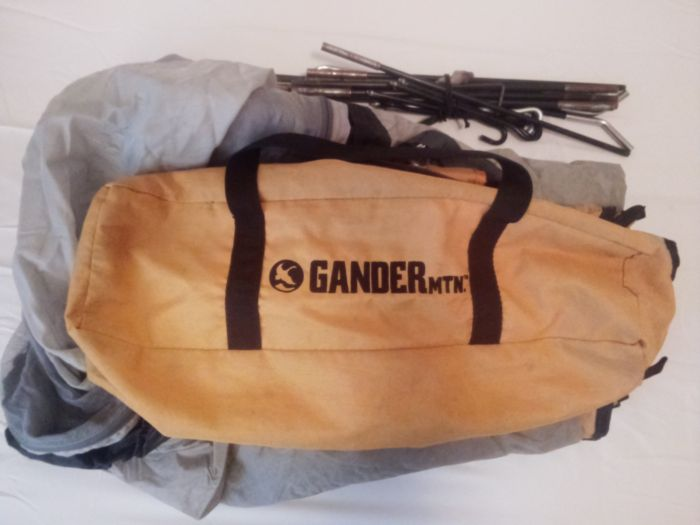
I don't even know what my tent is. A family member gave it to me as a gift when I was 16 years old, or around then. Its tiny (almost like a bivy), with enough head room to sit up; both of its long sides can be unzipped; it has a rainfly; it leaks like a sieve (sleeping in a literal puddle of water CAN feel good, but it usually doesn't); and slugs have stained it pretty badly. But, I love it (and new tents are expensive lol)

Iirc its 3.8 lbs, which isn't too bad

Along the same lines as my tent: I am a serial tent-stake-loser so I bought tent stakes on a few different occasions on the AT, and I found that these:
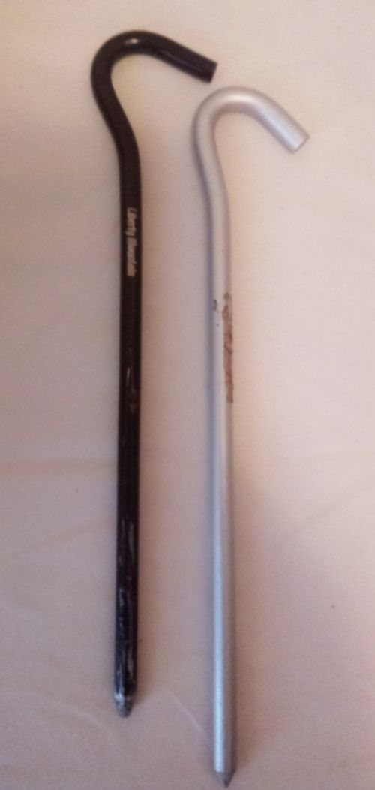
thick ones, Are really nice. But, I am going to get some retroreflective tape because these tent stakes can just evaporate as soon as they hit the ground. That would be a recommendation of mine, but I haven't tried it yet, so I don't know if it'll actually be any good

Hiking / trekking poles: the semi-ubiquitous Cascade Mountain Tech trekking poles
[Amazon](https://www.amazon.com/Cascade-Mountain-Tech-Aluminum-Collapsible/dp/B01L2HYPNW/ref=sr_1_1)

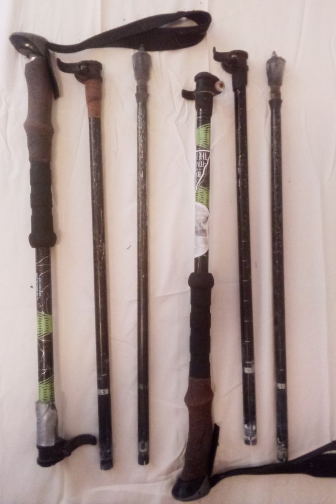
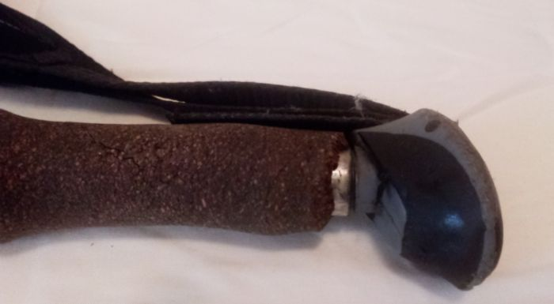
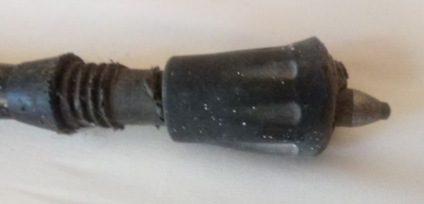

I think these were around `$30` and wow they're really great trekking poles

Unfortunately, I didn't get the fabled polished cork handles (constant sweat and friction literally polishes the cork grips so they become shiny, and look like what they are: polished wood); instead, mine just cracked and fell apart. I don't know why

At one point (in NH!) I slipped a little and my right trekking pole was caught between two rocks and got bent as I slowed my fall with it. I managed to bend it back alright, but from that point on I couldn't collapse that one anymore. But that's not too bad because I can actually just pull them apart at each segment to disassemble them (that's how they are in the picture)

I initially kept mudbaskets on the ends of my poles which really is extremely effective at preventing you from going too deep into rocks and bending your poles, but then I lost *just one* of them. I couldn't stand the asymmetry, and I was worried that of I got used to one pole not going into rocks I would eventually not think of it and get the other pole stuck in rocks and bend the pole, so I took the remaining mudbasket off. I went for a long time like that, that's when I bent the one of my poles anyway. But I eventually learned that if you put rubber tips on your poles, they don't come off, so you can't lose them; but what happens is that your metal tips blast right through the rubber tips and you get the best of both worlds: the metal tips dig into rocks to give you friction, the rubber tips stop the poles from going deep between rocks, and stops them from collecting leaves and mud (that's one thing I really, really hated about mudbaskets: they collect an unholy mix of mud, leaves, and everything else and increase the effective weight of the poles by a lot (because the weight is at the end of the poles, so they require a much larger torque to rotate))
 
I got a few extra tips at various points because when the tips grind down they get really slippery, and so you have to jab them into the ground straight on or else you might slip off. That makes them less effective. The tips I started with actually ground down so deep not only past the plastic holder for the metal end, but so far that the metal posts holding the ends actually broke off and got trapped inside the poles. So the original tips were just plastic nubs when I switched them out

The first set of tips I got where these [black diamond ones](https://www.amazon.com/gp/product/B000UYTFCA/ref=ppx_yo_dt_b_search_asin_title). These were all right but they were way, way too long. I actually liked that they were slightly longer because of the slightly longer reach, but what ended up happening was they would jab down into rocks and then I would accidentally crank them and they would bend a lot. They finally were so bent that they really resembled bananas. I knew I had to have grippier tips before going into Shenandoah NP, so I picked them up in Waynesboro VA, which is *just* before you enter the par

Then I got these [off brand universal ones](https://www.amazon.com/gp/product/B07SSQSBW9/ref=ppx_yo_dt_b_search_asin_title) and had them sent to my home. When my mom drove up to NH and met up with me, she brought them. These ones are fine, no grievances or anything. I think that some people probably have more refined tastes about their trekking pole tips but, meh, I'm fine with the cheaper ones. These cheaper ones didn't just flat out break easier or grind down quicker or anything, and they served me just fine going through NH and Main

Blanket: RICHHORSE Down Camping Blanket
[Amazon](https://www.amazon.com/gp/product/B08ZNQ73XG/ref=ppx_yo_dt_b_search_asin_title)

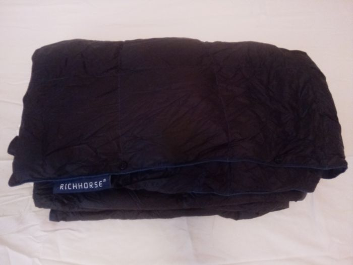

I think this was actually `$30` when I bought it. I picked it up in Virginia in Pearisburg, which is a more or less standard place to do sleeping-gear swaps

Honestly, this is a great blanket; you definitely couldn't survive (at least not comfortably) for very long when its really cold out using this blanket, but its pretty comfortable

I remember the first night after I picked this up, I had sent my sleeping bag back home in the mail and so my future nights sleeps would be entirely on this blanket, and I unpacked it from its bag and I swear it looked like a completely flat black plastic trashbag. I was really worried but slowly it started inflating and eventually grew to be a few inches in thickness

It definitely isn't a cold weather blanket, but it definitely kept me warm enough throughout most of Virginia in late spring, and through to Katahdin. There were a few shelter-stays for me where I was colder than I would have liked, but it really wasn't too bad

It also effectively blocked mosquitos just fine

Sleeping bag: ???

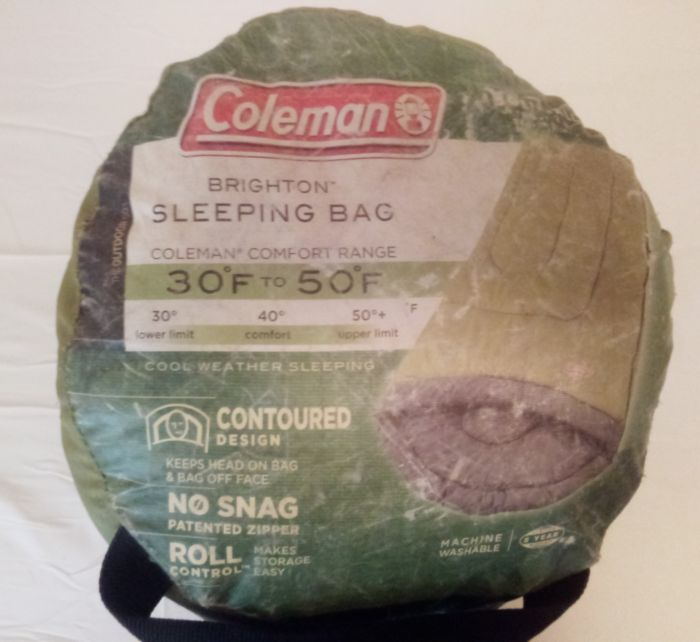
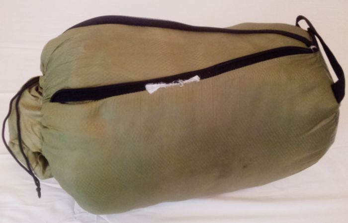

I have no idea how much this sleeping bag was originally. I've had it for a very long time. I got it when I was a teenager

It says it's like a 30 degree bag, or something, but it really goes much farther down than that. When I got caught in that big snow storm in early April (?) in the Smokeys, I was perfectly warm in it (Even after I was literally hypothermic a few times and shaking uncontrollably, I just got into my sleeping bag and was fine after a few minutes)

The major problem with it thought: no, not that its heavy (its 4.5 lbs!); but that its super fuckin bulky and you *cannot* get it to squash down smaller. Its has synthetic fiber filling and it just doesn't compress for anything. It compresses so little that if I were to use it with my current G4-20 it actually fills up essentially the entire main compartment. Meaning, I actually can't use it with my G4-20 because it just takes up too much space. I might be able to get a compression sack for it, but honestly, I'd rather just get a 2.5lb lighter bag that naturally compresses more. I'm poor af though so that'll have to wait

Cordage: 550 lb, 50' Foot
[Amazon](https://www.amazon.com/gp/product/B00GWS3I1W/ref=ppx_yo_dt_b_search_asin_title

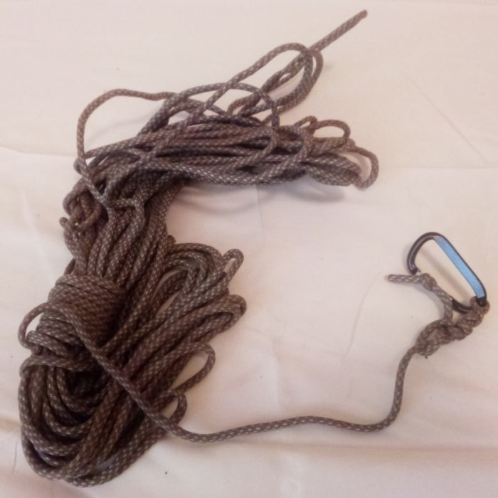

This stuff is great. Its basically indestructible. Holds weight really well and doesn't stretch that much. Its easy to tie and work with. Not too heavy (0.25 lbs)

I have a carabiner permanently attached to it because it exclusively use it to hang food bags

Its great, however, it gets caught on literally everything as you drag it back to you. Its like its surface is made of velcro and its alive and actually ties itself onto every little fuckin twig and leaf it comes across. I really really hate that. It gets caught on so much stuff I've actually had to climb trees to un-stick it from branches and stuff. 100% this rope is the reason I'm now willing to go with a bear canister lol

Sitting / sleeping pads: EVA Foam pads
[Amazon](https://www.amazon.com/gp/product/B07RFFGQM6/ref=ppx_yo_dt_b_search_asin_title)

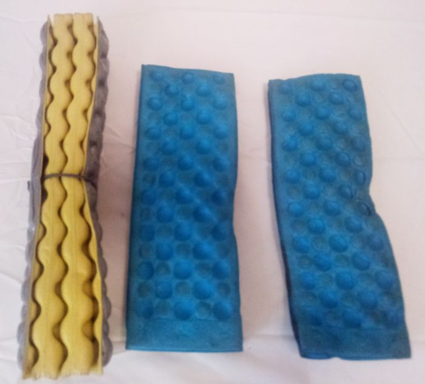

I think these were maybe like $8 when I bought them. They weight absolutely nothing and they're really versatile

When I thru hiked the AT I always had one stuffed between my back and my pack to act as an extra cushion and because it was just a really excellent place to keep one that you could just whip out and sit on. Interestingly, my new G4-20 actually makes use of a closed-cell foam pad as a make-shift pseudo-frame

Highly recommend these things

Oh, also, in that picture above I also have this yellow pad that isn't technically mine. I found it *just* before knifes edge in Pennsylvania. I asked absolutely everyone I came across for a few hundred miles after that point if the pad was theirs. Eventually I just adopted it. If you lost a pad just like that one just before knifes edge in Pennsylvania, I'd love to hear from you!

Water purification: Polar Pure
[Amazon](https://www.amazon.com/Polar-Pure-Iodine-Purifier-Sterilizes/dp/B00N5AGT1Q)

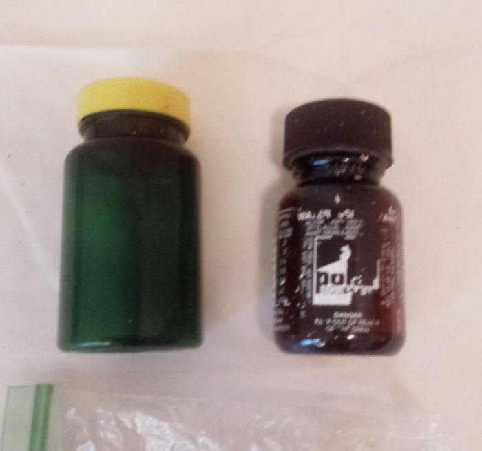

I kind of only used this in the Highlands in Virginia and in the Beaverlands in Vermont, New Hamshire, and Maine because I was afraid the pony and beaver shit would give me giardhia

I also used these Chlorine Dioxide tablets I got in Virginia. They work great but you have to let your water sit for 3 hours before drinking it, which really sucks

Water filtration: Sawyer Squeeze

My system for using it when hiking is: keep it immediately available like in my 

I learned of a really strange way to *back flush* a sawyer squeeze: fill it with water by filtering some water with it, then tap the filter into your palm a few times from different angles, then pressurize the inlet end by blowing into it with your mouth in the same way you typically get water out when hiking. You have to do it a few times, but the water that comes out should gradually become clearer after starting out usually really gross looking. I found that this was a far more effective way to 

I initially used the sawyer squeeze bags to filter water. The first one lasted through to pennsylvania, then the second lasted through to just before the 100 mile wilderness. Most hikers I asked said either that theirs would blow out really quickly, or would last a really long time. I get the sense its differences in how people filter water. I think mine lasted so long at first because I was trying to not have it blow out and filtering gently, but then later my filter was basically clogged all the time so I applied much more force

I never had any issues with my filter freezing (That I know of!). I kept my filter in my front pocket through the Smokeys (which was a winter hell when I was there) and on cold days and nights; and later next to my in my waist-pack; so I don't think it ever really got cold enough to freeze. But a really surprising number of hikers were pretty afraid of their filters freezing. So much so that a few people I talked to switched to new filters when warmer weather arrived just in case

After my second squeeze bag blew out, though, I got a CNOC bag, which I still have. CNOC bags are great, but, they're extremely stretchy and so its much more difficult to filter water. But given that they roll up really easily, they have a huge opening for quickly filling (and which also enables scooping), and they have a cap that actually works, I give them a 10/10 rating or whatever

I typically wrap my squeeze filter in my filter bag and put that into my waist pack so I don't even have to take off my pack to get to it. Though, I can pretty easily reach the side pockets of my G4-20 without taking it off, so I might switch to keeping the filter+bag in there

Jacket: ANOTHER CHOICE Men's Down Jacket
[Amazon](https://www.amazon.com/gp/product/B09CMZBMJG/ref=ppx_yo_dt_b_search_asin_title)

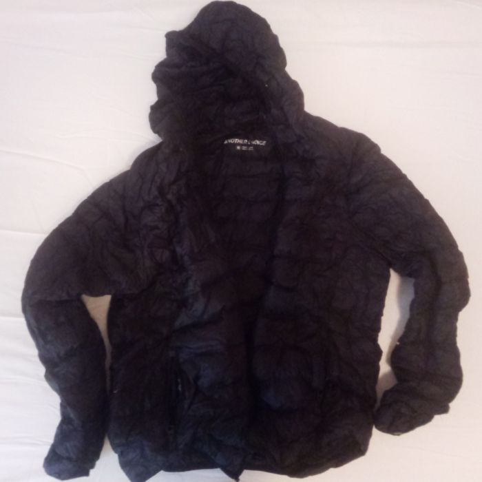

Again, I think this was actually like $30 when I bought it. It seems like everything has gone up in price

This was my baby on trail. Man, it worked great. I mean, for 95% of the colder weather, I was perfectly comfortable. During that snowstorm in the smokeys, I had to keep moving or else I would get too cold (I was also wearing a shirt and sweater under the jacket in this case), but otherwise my jacket was completely sufficient

I do have two issues with this, though: 1) it constantly emits tiny feathers (I don't know where they come out from, I just ever see them floating around), 2) it gets pretty flat over the course of 2200 miles of constant use, probably because its constantly shooting out feathers. Despite it being flatter, though, its still amazingly warm and pretty much completely blocks the wind

Overall, I my cheap jacket was great, but I do think a puffy jacket like this is such an important item that it might be worth it to get a more expensive one

Rain gear: Frogg Toggs
[Amazon](https://www.amazon.com/gp/product/B007X5XES0/ref=ppx_yo_dt_b_search_asin_title)

I knew from the onset that I was going to get wet on the AT, and I was right lol. You can't really avoid it. I think there are some items that might the experience of being wet much better, and some that may save certain parts of your body (eg: your feet are the most important thing to keep dry, is there a way to keep them dry? (My mom and I [are going to the AT](/stuff/misc/frontend.html?file=/stuff/pages/at-trail-magic.escm) to do trail magic probably in late may or around that time, and I'm planning on experimenting with layers of plastic bags and socks to keep my feet dry. Note: you can't actually keep your feet totally dry because even with totally waterproof boots and good socks, gaitors, etc, your feet will sweat, but you can keep them dry enough that you don't start developing trenchfoot and don't massively increase your friction)). Generally, you have to make sure your legs and torso stay dry, or if they get wet to keep them out of the wind, so that you don't start getting cold. Being wet, particularly when sleeping, is uncomfortable and is terrible for morale, but as long as you don't start getting cold or your feet start falling apart (trenchfoot sucks), you should be ok.

So, *Frogg Toggs* rain gear sucks really hard. At least this jacket + pants pair sucks. I would describe the material they're made out of as rubberized dryer sheet. They rip extremely easily. Their rubber-ish coating deteriorates and disappears very quickly. It stops water from flowing over your body, but water is going to get in the jacket and you're going to get wet. Also, its universally 

I honestly don't know if getting a more expensive, heavier jacket and rainpants is the best idea or not. 

Stove: Trangia stove
[Amazon](https://www.amazon.com/gp/product/B000AR7970/ref=ppx_yo_dt_b_search_asin_title) stove
Cookware: Toaks 900ml pot
[Amazon](https://www.amazon.com/gp/product/B00JZ1CLE8/ref=ppx_yo_dt_b_search_asin_title) pot

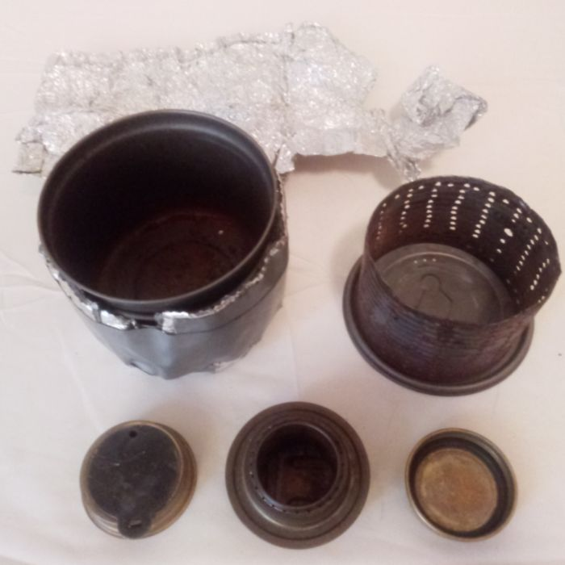

I actually sent my stove and pot back at some point because I discovered that I just really didn't care enough about having hot food to keep using it. I did run out of fuel a few times, because there were some dead-zones where nobody sold fueld, but generally the main hastle was just heating food up. So much easier to just eat cold food. But, telling that to other hikers made me realize that almost nobody feels that way lol, and almost everyone really really wants a hot meal at least once a day. If you don't need hot food, man, that's a superpower because cooking

Cathole spade: The Deuce #3
[Amazon](https://www.amazon.com/gp/product/B071ZJ16ZB/ref=ppx_yo_dt_b_search_asin_title)

This worked really well and generally I really liked it

I lost mine later on and made do with using branches, rocks, tent stakes, and my boot (I know, I know...) to dig catholes, but primarily my strategy was just using privys lol. My next spade I'm going to **wrap with retroreflective tape(!)** so that I can actually see it and don't lose it (Hah! Fat chance I won't lose it)

One problem I had was the handle digs into your hand. Technically, you're supposed to turn it around and use the handle too to leverage out a 'plug' of the ground, but I eventually would just jam the front into the ground and just pivot it around to work it deeper and around rocks (which are definitely the major obstacle when digging catholes). But it would dig into my hand when I did this, so I would frequently set a flat rock between my palm and the handle to distribute the force across my palm

Misc

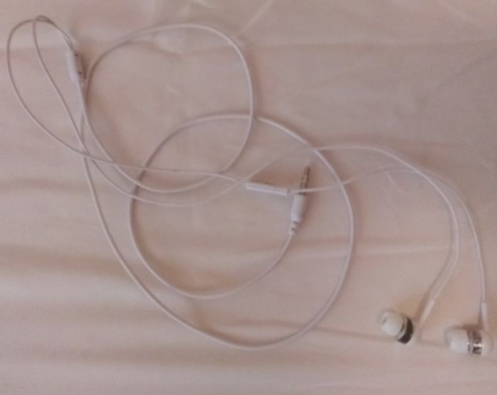

Earbuds. I destroyed my first pair (The wires tend to pull away from the actual earbud body, and with constant movement, even gentle movement, they eventually pull out, expose the metal and stop working), so I got another pair. Then I lost that pair, which isn't surprising, so my Mom got me a pair. Pictured is that last pair, which is my current pair. I think all pairs together cost less than $30

Past Pearisburg (which is when I got my first pair of earbuds), I would listen to text to speech. Text to speech was my predominant entertainment source from then on. I read countless books. That let me keep my sanity on some of the more boring days. So earbuds are a must have for me. Besides just for reading while hiking, T2S is really great in general. I highly recommend the app `@voice`; heres a [link](https://play.google.com/store/apps/details?id=com.hyperionics.avar&gl=US). The voice is a little robotic and distracting because of that *at first*, but you eventually get used to it. You even get used to the strange cadence that the current version of the T2S engine on android uses

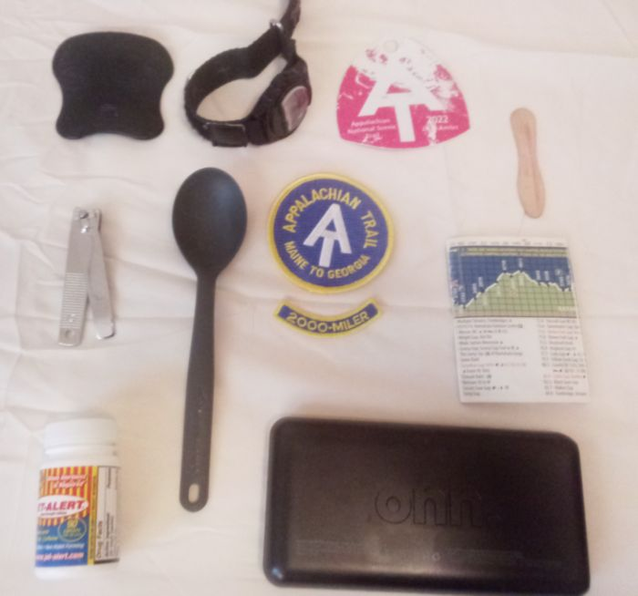

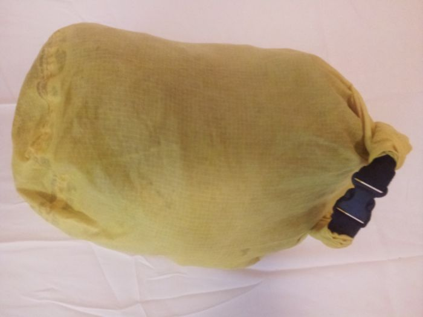
[Stuffsack Amazon](https://www.amazon.com/gp/product/B08G871KVB/ref=ppx_yo_dt_b_search_asin_title)
[Drybag Amazon](https://www.amazon.com/gp/product/B001AZNATC/ref=ppx_yo_dt_b_search_asin_title)

General purpose bags are super important and so nice to have on the AT. I have two sets: one set of stuffsacks, and a set of drybags.

The stuffsacks are awesome and really useful. They're super cheap but hold up really well. But they definitely aren't waterproof, though haha. Even if you hang them upside down

The drybags are also not waterproof. At least not after a few weeks / months. That isn't surprising considering the general rule of thumb that nothing is waterproof indefinitely

Honestly though, the real OG bags on the AT are garbage bags and plastic freezer and sandwich bags. They weight practically nothing, and come in handly all the time. Even just for partitioning stuff inside of another bag, cheap, lightweight containers are so nice to have, and freezer bags work amazingly well for this. *Plus* freezer bags are really waterproof as long as they don't have a split along the side. Though, that is one problem they tend to have: the closure on top tends to slip along the sides and the split then will work its way down the sides of the bag.

Oh, also, not pictured: a head bug net thing. You don't have to wear them with a hat, you can put them right over your head. I didn't get a single bite and that's the only way I ever used mine. Though I think if you have a bigger head your skin might press into the net in more places and give more opportunities for bugs to bite you.

Also pictured above: caffeine can be extremely important for keeping you going. I just took caffeine pills because they're easily the cheapest and easiest way to get caffeine (see [here](/stuff/misc/frontend.html?file=/stuff/pages/caffeine.escm)). But I also had to have the caffeine pills because I have ADHD and need stimulants anyway

That black thing in the top left corner of the above image is the plastic inside of a cheap walmart arch support orthotic. I can't remember where I got mine, I'm like 90% sure it was in Pennsylvania though. I had a lot of pain in the bottom of my feet because of the rocks and I was worried about contracting tendonitis, so I went to a walmart that was near the trail and got these arch supports. But, wow, these things are great. I think they saved my arches, too, because mine didn't fall

Average speed, calories, etc

I don't actually know how many calories I was consuming or losing on any given day, but knowing that I could binge on ***literal*** entire cakes, or entire 12-count packs of cinnamon buns, or entire 12'' pizzas, or entire 2lb jars of peanut butter, or ENTIRE PACKS of bagels with entire pack**S** (plural, yes) of cream cheese spread on them, and much more, on *literally* any given day, then later throw back a 1/2 gallon of chocolate milk, and not gain any weight but only constantly lose weight slowly; I must have been burning a lot of calories per day

Before leaving for the AT I had this whole meal plan with 3.5k calories for an average day of hiking 🙄. Yeah, try more like 6k+ calories in reality. My meal plans went out the window the first time I got a craving for pizza

My average speed was iirc 22 mi/day taking zeros and everything into account

